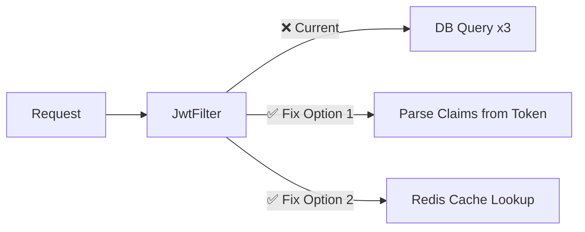

# 🔍 DMA-Backend Production Audit Report

> **Date**: 2026-08-24  
> **Scope**: Full codebase — Auth, Lead, Client, Project, Invoice, Menu, Config, Infrastructure  
> **Lens**: Interview-readiness, scalability to 1M users/documents, design patterns, security

---

## Executive Summary

| Severity | Count |
|----------|-------|
| 🔴 Critical | 6 |
| 🟠 High | 11 |
| 🟡 Medium | 7 |
| 🟢 Low | 3 |
| **Total** | **27** |

> [!CAUTION]
> 6 Critical issues found. These are the ones an interviewer will immediately challenge you on if you claim this project handles scale.

---

## 🔴 CRITICAL Issues (Fix These First)

### C1 — JWT Filter Hits DB 3 Times Per Request (Defeats Statelessness)

**Files**: [JwtFilter.java](file:///home/sayless/DMA/DMA-backend/src/main/java/com/viraj/dmabackend/auth/security/JwtFilter.java), [CustomUserDetailsService.java](file:///home/sayless/DMA/DMA-backend/src/main/java/com/viraj/dmabackend/auth/security/CustomUserDetailsService.java)

**Problem**: Every authenticated request triggers `loadUserByUsername()`, which executes **3 MongoDB queries** (User → Role → Permissions). This completely defeats the purpose of JWT (stateless auth).

**Scalability Impact**: At 10K concurrent users making 10 requests/second = **300K DB queries/second** just for auth. The database will collapse.

**Interview Question**: *"If JWT is stateless, why are you hitting the database on every request?"*

**Fix Options**:
1. **Embed claims in JWT** — Put `role` and `permissions` directly in the token payload. Parse them from the token instead of querying DB.
2. **Redis session cache** — Cache `UserDetails` in Redis with TTL matching token expiry.

---

### C2 — N+1 Query in `getAllUsers()` (Classic Interview Trap)

**File**: [UserServiceImpl.java](file:///home/sayless/DMA/DMA-backend/src/main/java/com/viraj/dmabackend/auth/service/impl/UserServiceImpl.java)

**Problem**: Fetches a `Page<User>`, then loops through each user calling `findRoleById(user.getRoleId())` individually. Fetching 50 users = 1 query + 50 role queries = **51 queries**.

**Scalability Impact**: At 1M users, paginating 100 per page still fires 101 queries per page load.

**Interview Question**: *"How many database queries does your list users endpoint make? What's the time complexity?"*

**Fix**: Batch-fetch all unique `roleId`s in one query, build a `Map<String, Role>`, then map in-memory.

---

### C3 — Regex Search Cannot Use Indexes (Full Collection Scan)

**Files**: [UserRepository.java](file:///home/sayless/DMA/DMA-backend/src/main/java/com/viraj/dmabackend/auth/repository/UserRepository.java), [LeadRepository.java](file:///home/sayless/DMA/DMA-backend/src/main/java/com/viraj/dmabackend/lead/repository/LeadRepository.java), [ProjectRepository.java](file:///home/sayless/DMA/DMA-backend/src/main/java/com/viraj/dmabackend/project/repository/ProjectRepository.java)

**Problem**: `ContainingIgnoreCase` generates MongoDB regex `{ $regex: ".*keyword.*", $options: "i" }`. This **cannot use B-tree indexes** and forces a COLLSCAN (full collection scan) on every search.

**Scalability Impact**: At 1M documents, search queries will take **seconds** instead of milliseconds and spike CPU on the MongoDB server.

**Interview Question**: *"How does your search work? What happens when the collection has a million documents?"*

**Fix Options**:
1. **MongoDB Text Index** — Add `@TextIndexed` on searchable fields, use `$text` queries.
2. **Elasticsearch/Atlas Search** — For advanced full-text search with fuzzy matching.

---

### C4 — Missing Optimistic Locking (Race Conditions)

**Files**: All entities — [Lead.java](file:///home/sayless/DMA/DMA-backend/src/main/java/com/viraj/dmabackend/lead/entity/Lead.java), [Client.java](file:///home/sayless/DMA/DMA-backend/src/main/java/com/viraj/dmabackend/client/entity/Client.java), [Project.java](file:///home/sayless/DMA/DMA-backend/src/main/java/com/viraj/dmabackend/project/entity/Project.java), [Invoice.java](file:///home/sayless/DMA/DMA-backend/src/main/java/com/viraj/dmabackend/invoice/entity/Invoice.java)

**Problem**: No `@Version` field on any entity. Two users editing the same invoice simultaneously → **last write wins**, silently overwriting the first user's changes.

**Interview Question**: *"What happens if two people update the same invoice at the same time? How do you handle concurrent writes?"*

**Fix**: Add `@Version private Long version;` to `BaseEntity`. Spring Data MongoDB will automatically throw `OptimisticLockingFailureException` on stale writes.

---

### C5 — Missing Transaction on Cross-Collection Operations

**File**: [LeadServiceImpl.java](file:///home/sayless/DMA/DMA-backend/src/main/java/com/viraj/dmabackend/lead/service/impl/LeadServiceImpl.java) (Line ~44-58)

**Problem**: `convertLeadToClient` creates a Client and updates the Lead status without `@Transactional`. If the Lead update fails after Client creation → **data inconsistency** (orphan client, unconverted lead).

**Interview Question**: *"What happens if the server crashes halfway through lead conversion? Is your data consistent?"*

**Fix**: Add `@Transactional` annotation. Requires MongoDB replica set (which Atlas provides by default).

---

### C6 — `MethodArgumentNotValidException` Not Handled

**File**: [GlobalExceptionHandler.java](file:///home/sayless/DMA/DMA-backend/src/main/java/com/viraj/dmabackend/exception/GlobalExceptionHandler.java)

**Problem**: When `@Valid` fails on a DTO, Spring throws `MethodArgumentNotValidException`. Without a handler, it falls to the generic `Exception.class` handler → returns **500 Internal Server Error** instead of 400 with field-level details.

**Interview Question**: *"What does your API return when a user submits invalid data? Show me the error response format."*

**Fix**: Add a dedicated handler that extracts `FieldError` details and returns them in the standard `ApiResponse` format.

---

## 🟠 HIGH Severity Issues

### H1 — Missing Database Indexes on Query Paths

| Entity | Missing Indexes | Query Using It |
|--------|----------------|----------------|
| [User.java](file:///home/sayless/DMA/DMA-backend/src/main/java/com/viraj/dmabackend/auth/entity/User.java) | `status`, `roleId` | `findByStatus`, `filterUsersByStatus` |
| [Project.java](file:///home/sayless/DMA/DMA-backend/src/main/java/com/viraj/dmabackend/project/entity/Project.java) | `clientId`, `status` | `findByClientId`, `findByStatus` |
| [Invoice.java](file:///home/sayless/DMA/DMA-backend/src/main/java/com/viraj/dmabackend/invoice/entity/Invoice.java) | `clientId`, `projectId`, `status`, `active` | Multiple queries |
| [Menu.java](file:///home/sayless/DMA/DMA-backend/src/main/java/com/viraj/dmabackend/menu/entity/Menu.java) | `active` + `orderIndex` (compound) | `findByActiveTrueOrderByOrderIndexAsc` |

**Interview Risk**: HIGH — *"Show me your indexes. What happens to this query at 1M documents?"*

---

### H2 — No Rate Limiting on Login Endpoint

**File**: [AuthController.java](file:///home/sayless/DMA/DMA-backend/src/main/java/com/viraj/dmabackend/auth/controller/AuthController.java)

Brute-force attacks can hammer `/api/auth/login` unlimited times. No account lockout mechanism exists.

---

### H3 — Hardcoded JWT Secret in Dev Config

**File**: [application-dev.yml](file:///home/sayless/DMA/DMA-backend/src/main/resources/application-dev.yml)

The JWT secret is committed to source control. If this repo is public, any person can forge valid tokens.

---

### H4 — Soft Delete Data Leaks

**Files**: [ProjectServiceImpl.java](file:///home/sayless/DMA/DMA-backend/src/main/java/com/viraj/dmabackend/project/service/impl/ProjectServiceImpl.java), [InvoiceServiceImpl.java](file:///home/sayless/DMA/DMA-backend/src/main/java/com/viraj/dmabackend/invoice/service/impl/InvoiceServiceImpl.java)

`deleteProject` sets status to `ARCHIVED` but `getProjectById` still returns it. Same for Invoice (`active = false` but `getInvoiceById` doesn't filter).

---

### H5 — Missing Token Refresh & Revocation

**Files**: [AuthServiceImpl.java](file:///home/sayless/DMA/DMA-backend/src/main/java/com/viraj/dmabackend/auth/service/impl/AuthServiceImpl.java), [JwtUtil.java](file:///home/sayless/DMA/DMA-backend/src/main/java/com/viraj/dmabackend/auth/security/JwtUtil.java)

No refresh token flow. No way to revoke a token once issued (e.g., on logout or password change). Token is valid until expiry regardless.

---

### H6 — Missing Invoice Audit Trail

**File**: [Invoice.java](file:///home/sayless/DMA/DMA-backend/src/main/java/com/viraj/dmabackend/invoice/entity/Invoice.java)

Financial records can be silently mutated without historical tracking. Compliance risk for any real agency.

---

### H7 — Menu Service Loads Entire Collection

**File**: [MenuServiceImpl.java](file:///home/sayless/DMA/DMA-backend/src/main/java/com/viraj/dmabackend/menu/service/impl/MenuServiceImpl.java)

`getAllMenus()` and `getMenuTree()` call `findAll()` — no pagination. At 10K+ menus → OOM risk.

---

### H8 — Dockerfile Layer Caching Issue

**File**: [Dockerfile](file:///home/sayless/DMA/DMA-backend/Dockerfile)

`COPY src src` before `RUN gradlew bootJar` invalidates Gradle dependency cache on every code change, causing full dependency re-download on every build (~5-10 min wasted per build).

---

### H9 — `ex.printStackTrace()` in Exception Handler

**File**: [GlobalExceptionHandler.java](file:///home/sayless/DMA/DMA-backend/src/main/java/com/viraj/dmabackend/exception/GlobalExceptionHandler.java)

Uses `ex.printStackTrace()` instead of SLF4J `log.error()`. In production, `printStackTrace()` goes to stderr, is unsearchable, and not structured.

---

## 🟡 MEDIUM Severity Issues

| # | Issue | File | Interview Risk |
|---|-------|------|---------------|
| M1 | Missing `AuditorAware` bean — `createdBy`/`updatedBy` always null | [MongoConfig.java](file:///home/sayless/DMA/DMA-backend/src/main/java/com/viraj/dmabackend/config/MongoConfig.java), [BaseEntity.java](file:///home/sayless/DMA/DMA-backend/src/main/java/com/viraj/dmabackend/common/entity/BaseEntity.java) | Medium |
| M2 | Missing API Versioning (`/api/menus` → should be `/api/v1/menus`) | All Controllers | High |
| M3 | Tight coupling: `LeadService` directly calls `ClientService` | [LeadServiceImpl.java](file:///home/sayless/DMA/DMA-backend/src/main/java/com/viraj/dmabackend/lead/service/impl/LeadServiceImpl.java) | Medium |
| M4 | Missing Project status workflow validation | [ProjectServiceImpl.java](file:///home/sayless/DMA/DMA-backend/src/main/java/com/viraj/dmabackend/project/service/impl/ProjectServiceImpl.java) | Medium |
| M5 | Missing `@Transactional` on Menu service mutations | [MenuServiceImpl.java](file:///home/sayless/DMA/DMA-backend/src/main/java/com/viraj/dmabackend/menu/service/impl/MenuServiceImpl.java) | High |
| M6 | Unsafe BigDecimal arithmetic (NPE risk) | [InvoiceServiceImpl.java](file:///home/sayless/DMA/DMA-backend/src/main/java/com/viraj/dmabackend/invoice/service/impl/InvoiceServiceImpl.java) | High |
| M7 | Missing request tracing (correlation ID) | Global | Medium |

---

## 🟢 LOW Severity Issues

| # | Issue | File |
|---|-------|------|
| L1 | Redundant custom `/health` endpoint (Actuator already exists) | [HealthController.java](file:///home/sayless/DMA/DMA-backend/src/main/java/com/viraj/dmabackend/controller/HealthController.java) |
| L2 | CORS origins hardcoded in SecurityConfig | [SecurityConfig.java](file:///home/sayless/DMA/DMA-backend/src/main/java/com/viraj/dmabackend/config/SecurityConfig.java) |
| L3 | Default BCrypt strength (10) — could specify 12 for stronger hashing | [SecurityConfig.java](file:///home/sayless/DMA/DMA-backend/src/main/java/com/viraj/dmabackend/config/SecurityConfig.java) |

---

## 📋 Interview Cheat Sheet — Top 5 Questions You WILL Be Asked

| Question | Current Answer | What They Want to Hear |
|----------|---------------|----------------------|
| *"How does your auth scale?"* | JWT + 3 DB queries per request | Embed claims in JWT, zero DB hits per request |
| *"What happens at 1M documents?"* | Regex search = full collection scan | Text indexes or Elasticsearch for search, B-tree indexes on all query paths |
| *"How do you handle concurrent writes?"* | Last write wins (data loss) | `@Version` optimistic locking, `OptimisticLockingFailureException` handling |
| *"What if the server crashes mid-operation?"* | Partial data inconsistency | `@Transactional` on cross-collection ops, idempotency keys |
| *"How do you handle 10K requests/second?"* | Every request hits DB 3x for auth alone | Caching (Redis), connection pooling, async processing, horizontal scaling |

---

## 🏗️ Missing Design Patterns Summary

| Pattern | Status | Where Needed |
|---------|--------|-------------|
| Optimistic Locking | ❌ Missing | All entities |
| Event-Driven (Domain Events) | ❌ Missing | Lead → Client conversion |
| CQRS (Read/Write separation) | ❌ Missing | Search vs. CRUD operations |
| Circuit Breaker | ❌ N/A yet | Future external service calls |
| Repository Pattern | ✅ Present | All modules |
| Service Layer Pattern | ✅ Present | All modules |
| DTO Pattern | ✅ Present | All modules |
| Builder Pattern | ✅ Present (Lombok) | All entities/DTOs |
| Strategy Pattern | ❌ Missing | Status workflow validation |
| Template Method | ❌ Missing | Common CRUD operations |
